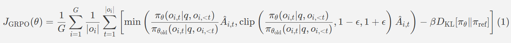
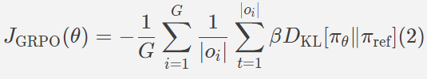
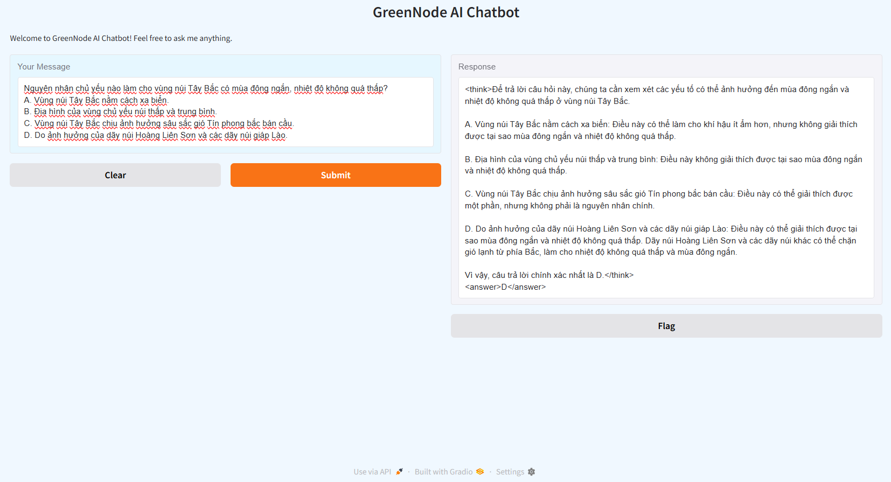
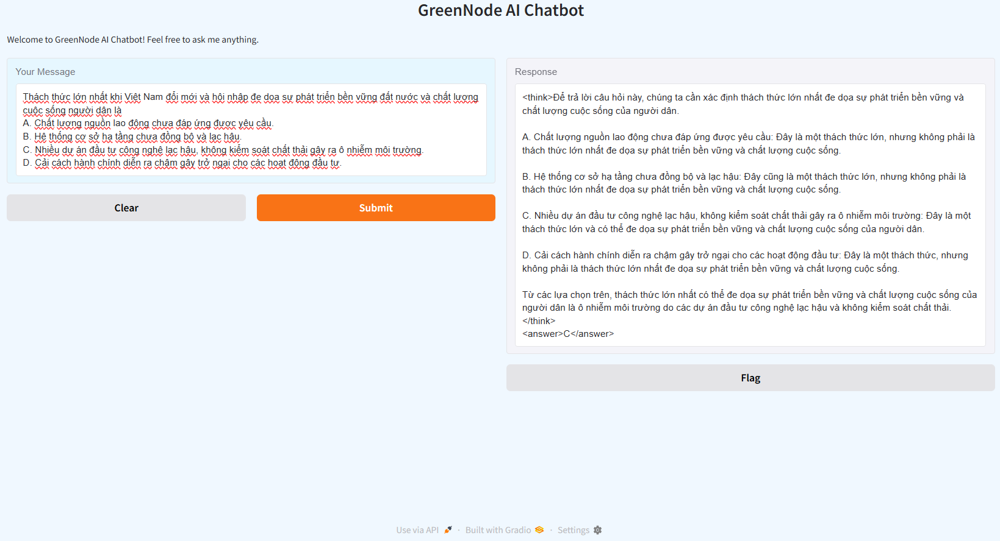

# An easy path to capturing Group Relative Policy Optimization

Earlier this year, the release of **DeepSeek-R1** sent shockwaves through the AI industry. This open-source model demonstrated reasoning capabilities on par with OpenAI's **GPT-4-o**, leveraging **Group Relative Policy Optimization (GRPO)** and a reinforcement learning-driven multi-stage training approach. Not only did DeepSeek unveil the model itself, but they also published a research paper detailing the techniques behind its development.

In this blog, we aim to provide an overview of **GRPO** and recreate the **"aha moment"**, which the authors of **DeepSeek** described in their paper as follows:

> *"This behavior is not only a testament to the model’s growing reasoning abilities but also a captivating example of how reinforcement learning can lead to unexpected and sophisticated outcomes."*

## 1) What is GRPO?

Group Relative Policy Optimization (GRPO) is a reinforcement learning algorithm tailored for training large language models (LLMs) on complex tasks such as mathematical problem-solving and code generation. Unlike traditional approaches, GRPO is more memory-efficient as it eliminates the need for a separate value function, which typically predicts future rewards. Imagine the Large Language Models (LLMs) generating multiple responses, while you act as a teacher or judge, assigning scores by automatically judging based on designing specific rules (considered as rewards) to these responses. The average score then serves as the basis for optimization. This design allows large models to be trained on constrained hardware while maintaining strong performance on challenging reasoning tasks. So far, this approach has been effective in tackling challenges that require detailed reasoning before arriving at a final answer, including the form of a short answer or a multiple-choice selection.

## 2) Why GRPO is promising?

Reinforcement learning (RL) is a subfield of Machine Learning (ML) in which an agent learns to make decisions through interactions with its environment, aiming to maximize cumulative rewards. When applied to LLMs, RL helps fine-tune these models to better align with human preferences and improve their performance on specialized tasks such as mathematical problem-solving and code generation.
A key category of RL algorithms is policy optimization, which focuses on directly refining the policy—the decision-making strategy an agent follows based on different states. One widely used algorithm in this category is Proximal Policy Optimization (PPO), valued for its stability and efficiency. PPO employs a clipped surrogate objective to prevent drastic policy updates and incorporates a value function to estimate advantages, ensuring a more stable learning process.
However, as LLMs scale up and tasks grow more complex, PPO encounters limitations, particularly in terms of memory consumption and computational demands. The need to maintain a value function—often represented by an additional neural network of similar size to the policy model—adds substantial overhead, increasing resource requirements and making large-scale training more challenging.
To tackle these challenges, Group Relative Policy Optimization (GRPO) was introduced in the paper: "DeepSeekMath: Pushing the Limits of Mathematical Reasoning in Open Language Models". GRPO aims to improve the reasoning abilities of LLMs, especially in mathematical problem-solving and code generation.

## 3) The Mathematics behind DeepSeek R1

Specifically, for each question $q$, GRPO samples a group of outputs ${o_1,o_2,…,o_G}$ from the old policy $π_{θ_{old}}$​​ and optimizes the policy model $π_θ$ by maximizing the following GRPO objective function:


, where:
-   $G$ is the number of generations per prompt.
-   $o_i$​ represents the $i$-th generated output, and $∣o_i∣$ denotes the number of tokens in $o_i$​.
-   $q$ is the given prompt.
-   $π_θ$ is the current policy model.
-   $π_{θ_{old}}$​​ refers to the policy model before the update.
-   $π_{ref}$​ is the reference policy.
-   $\hat{A}_{i,t}$​ is the estimated advantage for the $t$-th token in the $i$-th generated output.

To simplify, we ignore the gradient, leading to $π_θ=π_{θ_{old}}$. The objective function is equivalent to:


You can find the detail proof in [GRPO-Loss-Discussion](https://github.com/huggingface/open-r1/issues/239). With Equation (2), you can see that at the beginning of training, the objective function starts at 0 and then gradually increases. Note that the Kullback-Leibler divergence approaches infinity as the distributions of $π_θ$ and $π_{ref}$​ become more different.

## 4) Reward functions
The reward serves as the foundation for the training signal, guiding the optimization direction in reinforcement learning. To train DeepSeek-R1-Zero, authors implemented a rule-based reward mechanism comprising two primary reward types:

- *Format rewards*: This function is used to evaluate the model's ability to generate responses that adhere to the desired structure.
- *Accuracy rewards*: This function is used to evaluate whether the extracted result (obtained from the response using a heuristic or structure-based method) matches the ground truth.

## 5) Step-by-step to reproduce "aha" moment

In this section, we will guide you through the setup for fine-tuning any LLMs with reasoning styling similar to DeepSeek R1.

<u>Step 1:</u> Set up environment.
You should set up a Conda environment or configure a Docker image with Python 3.10, then install the following libraries:
```
pip install "torch==2.5.1" tensorboard "setuptools<71.0.0" --index-url https://download.pytorch.org/whl/cu121 
pip install flash-attn 
pip install --upgrade \ "transformers==4.48.1" \ "datasets==3.1.0" \ "accelerate==1.3.0" \ "hf-transfer==0.1.9" \ "deepspeed==0.15.4" \ "trl==0.14.0"  
pip install "vllm==0.7.0"
pip install gradio
```
<u>Step 2:</u> Training Script. 
For easier modifications, you can refer to the source code at: [GRPO-Script](https://github.com/philschmid/deep-learning-pytorch-huggingface/blob/main/training/scripts/run_r1_grpo.py). This script includes the following components:
-   Dataset: Load dataset → Apply conversation template → Tokenize → Split dataset.
    
-   Reward functions: Contains two functions corresponding to Section 4. These functions return specific values within the range $[0.0, 1.0]$. However, you can modify them to with any specific range and design additional reward functions as needed.
    
    -   Format reward: Ensure that inferred content is enclosed within `<think>...</think>` tags and the final answer is within `<answer>...</answer>` tags.
  	```
   	regex = r"^Let me solve this step by step\.\n<think>([^<]*(?:<(?!/?think>)[^<]*)*)<\/think>\n<answer>([^<]*)<\/answer>\Z"
        match = re.search(regex, completion, re.DOTALL) 

	if match is None or len(match.groups()) != 2:
            rewards.append(0.0)
        else:
            rewards.append(1.0)
      except Exception:
        rewards.append(0.0)
   	```
    -   Accuracy reward: Require the response to follow the correct format and compare the answer with the target.
      	```
       	try:
            answer_regex = r"<answer>(.*?)<\/answer>"
            answer_match = re.findall(answer_regex, completion)
            if len(answer_match) == 1:
                if answer_match[0] == choice:
                    rewards.append(1.0)
            else:
                rewards.append(0.0) 
        except Exception:
                # If evaluation fails, reward is 0
                rewards.append(0.0) 
       	```
        
- Finetune LLMs based on <u>GRPO Trainer</u>.
  
<u>Step 3:</u> Set up hyperparameters.
	- You can see the hyperparameters of DeepSpeed at [DeepSpeed Zero3](https://github.com/huggingface/trl/blob/main/examples/accelerate_configs/deepspeed_zero3.yaml). DeepSpeed is an open-source deep learning optimization library developed to improve the efficiency, scalability, and performance of training large-scale AI models. It provides features like memory optimization, mixed-precision training, zero redundancy optimizer (ZeRO), and efficient distributed training, enabling faster and more cost-effective model training on large datasets.
 
	`offload_optimizer_device`:  Specifies where to offload the optimizer states. 
	
		- `"cpu"`: Moves optimizer states to CPU memory. 
		- `"nvme"`: Moves optimizer states to NVMe storage for even lower GPU memory usage.
		- `"none"`: not offloading.

		`offload_param_device`: Specifies where to offload the model parameters.
		
		- `"cpu"`: Offloads model parameters to CPU, reducing GPU memory consumption.
		- `"nvme"`: Stores parameters on NVMe for extreme memory optimization, but with potential latency trade-offs.
		- `"none"`: not offloading.
		
		`num_processes`: specifies the number of parallel processes used for distributed training or data processing. If we need `n` GPUs for sampling with vLLM, then `num_processes` should be set to the total number of GPUs minus `n`.
	- You can refer to the ways to select specific model, dataset from Hugging Face Hub, and configure the training hyperparameters based on [this configuration](https://github.com/philschmid/deep-learning-pytorch-huggingface/blob/main/training/receipes/grpo-qwen-2.5-3b-deepseek-r1-countdown.yaml). 
		
## 6) Create your Chatbot
After fine-tuning the model, you can create a simple chatbot using Gradio based on the sample code below. 🤗
```
from vllm import LLM, SamplingParams
from transformers import AutoTokenizer

import argparse

import gradio as gr

from functools import partial

import random

def get_input(question):
    list_choices = ['A', 'B', 'C', 'D']
    random_choice = random.choice(list_choices)
    _input = [{
        "role": "system",
        "content": "You are a helpful assistant. Please reason step by step in Vietnamese, and put your final answer in <answer> </answer> tags. The answer could be a one of [A, B, C, D]."
        },
        { 
        "role": "user",
        "content": f"{question}. Think step by step in Vietnamese inside <think> </think> tags. And return the final equation in <answer> </answer> tags, for example <answer>{random_choice}</answer>."
        },
        {
        "role": "assistant",
        "content": "Let me solve this step by step.\n<think>"
        }]
    return _input

def _inference(question, tokenizer, llm, sampling_params):
    _input = get_input(question=question)
    prompt = tokenizer.apply_chat_template(_input,
                                        tokenize=False,
                                        continue_final_message=True)
    
    output = llm.generate([prompt], sampling_params=sampling_params)
    
    return "<think>" + output[0].outputs[0].text

def chatbot_response(message, tokenizer, llm, sampling_params):
    response = _inference(message, tokenizer, llm, sampling_params)
    
    return response

def main():
    parser = argparse.ArgumentParser(description="Process model checkpoint and dataset paths.")
    parser.add_argument(
        "--checkpoint_path",
        type=str,
        default="/network-volume/deepseek/runs/qwen-2.5-14b-r1-vmlu/checkpoint-3000",
        help="Path to the model checkpoint."
    )

    args = parser.parse_args()

    tokenizer = AutoTokenizer.from_pretrained(
        (
            args.checkpoint_path
        ),
        revision='main',
        trust_remote_code=False,
    )
    if tokenizer.pad_token is None:
        tokenizer.pad_token = tokenizer.eos_token
            
    llm = LLM(model=args.checkpoint_path)

    sampling_params = SamplingParams(temperature=0.0,
                                        max_tokens=1024,
                                        stop_token_ids=None)
    
    iface = gr.Interface(
        fn=partial(chatbot_response, tokenizer=tokenizer, llm=llm, sampling_params=sampling_params),
        inputs=gr.Textbox(
            label="Your Message", 
            placeholder="Type your message here...", 
            lines=1, 
            max_length=2000,
            elem_id="user-input-box"
        ),
        outputs=gr.Textbox(
            label="Response", 
            placeholder="Chatbot's response will appear here...", 
            lines=3, 
            max_length=5000,
            elem_id="chatbot-response-box"
        ),
        title="GreenNode AI Chatbot",
        description="Welcome to GreenNode AI Chatbot! Feel free to ask me anything.",
        theme="huggingface",  
     )

    iface.launch(share=True)

if __name__ == "__main__":
    main()
```
We present several inference results from the Qwen2.5 14B model, which has been fine-tuned on our custom dataset after 3000 steps. We pose a series of mathematical questions to challenge the model, and the results demonstrate detailed and accurate responses.






## 7) Resource
Fine-tuning a model with full parameters based on GRPO requires substantial GPU resources. For a model with approximately 14B parameters, we need 3 GPUs for training and 1 GPU for vLLM to generate outputs. Therefore, <marketing...>
